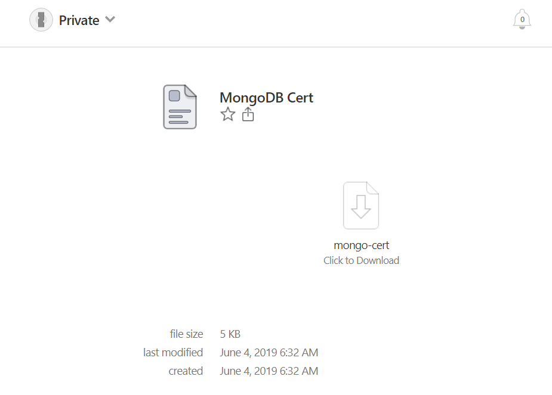

[]( https://g.codefresh.io/pipelines/terraform-provider-onepassword/builds?repoOwner=ameier38&repoName=terraform-provider-onepassword&serviceName=ameier38%2Fterraform-provider-onepassword&filter=trigger:build~Build;branch:master;pipeline:5cf5099a3d8de566d41eda11~terraform-provider-onepassword)
[](https://goreportcard.com/report/github.com/ameier38/terraform-provider-onepassword)

# 1Password Terraform Provider
Terraform data source (read: READ ONLY) provider for 1Password.

> This provider __does not__ create resources in 1Password. It requires
the user to have a 1Password account and to have created items in 1Password
prior to using. If you are interested in managing 1Password items through
terraform, please check out https://github.com/anasinnyk/terraform-provider-1password.

## Setup

1. Download the 1Password CLI for your system [here](https://1password.com/downloads/command-line/).

2. Install terraform. On Window's you can use `scoop`.
  ```
  scoop install terraform
  ```

3. Download the [latest release](https://github.com/ameier38/terraform-provider-onepassword/releases).
Add the `terraform-provider-onepassword_vX.Y.Z` file into the plugins directory. On Window's the
directory is `C:\Users\<user>\AppData\Roaming\terraform.d\plugins\windows_<arch>`.
> Read more about where to put third-party plugins 
[here](https://www.terraform.io/docs/configuration/providers.html#third-party-plugins).

## Usage

Create a variables file `terraform.tfvars` and make sure it is added to 
your `.gitignore` so you do not expose your 1Password credentials.
> Learn more about terraform variables [here](https://www.terraform.io/docs/configuration/variables.html).

Add the following variables to the `terraform.tfvars` files.
```tf
# terraform.tfvars

password = "<your 1Password password>"
secret_key = "<your 1Password secret key>"
```

Next, create a terraform file `providers.tf` and add the provider.
```tf
# providers.tf

variable "onepassword_password" {
  description = "Login password for 1Password"
}

variable "onepassword_secret_key" {
  description = "Login secret key for 1Password"
}

provider "onepassword" {
	email = "test@testing.com"
	password = "${var.onepassword_password}"
	secret_key = "${var.onepassword_secret_key}"
	subdomain = "test" # Optional. Comes from <subdomain>.1password.com.
}
```

Start using the provider to pull secrets. Let's say we
wanted to create a Kubernetes secret for our Redshift cluster.
We could create an item in 1Password called 'Redshift' in the
'Private' vault.


We could then create a `onepassword_item` data source to define a Kubernetes secret.
```tf
data "onepassword_item" "prod_redshift" {
  vault = "Private"
  item = "Redshift"
}

resource "kubernetes_secret" "redshift" {
  metadata {
    name      = "redshift"
    namespace = "default"
  }

  data {
    "redshift-user" = "${data.onepassword_item.dev_redshift.result["username"]}"
    "redshift-password" = "${data.onepassword_item.dev_redshift.result["password"]}"
    "redshift-host" = "${data.onepassword_item.dev_redshift.result["server"]}"
    "redshift-database" = "${data.onepassword_item.dev_redshift.result["database"]}"
  }
}
```
> Read more about creating Kubernetes secrets in terraform
[here](https://www.terraform.io/docs/providers/kubernetes/r/secret.html).

We could also use a document that has been uploaded to 1Password. This is useful for
certificates or PEM files that are used to connect to services.



Create a `onepassword_document` data source.
```tf
data "onepassword_document" "mongo_cert" {
  vault = "Private"
  document = "MongoDB Cert"
}

resource "kubernetes_secret" "mongo_cert" {
  metadata {
    name      = "mongo-cert"
    namespace = "default"
  }

  data {
    "mongo-cert" = "${data.onepassword_item.mongo_cert.result}"
  }
}
```
> The data source reads the contents of the file as a string.

## Developement

### Setup
Install go. On Window's you can use `scoop`.
```
scoop install go
```

Clone the repository.
```
git clone https://github.com/ameier38/terraform-provider-onepassword.git
```

### Testing
Run acceptance tests.
```
$env:TF_ACC="true"
go test ./onepassword
```
> On macOS or Linux, set the environment variable with `export TF_ACC=true`.

## Building
Build the package.
```
go build
```

Move the generated program to the terraform plugins directory.
For example, on Windows you could run the following:
```
mv -Force .\terraform-provider-onepassword.exe C:\Users\<user>\AppData\Roaming\terraform.d\plugins\windows_amd64\
```

### Releasing
Create a tag.
```
git tag -a v0.1.1 -m "Next release"
git push origin v0.1.1
```

Create a release.
```
goreleaser
```

## Contributing
If you find a :bug: please [create an issue](https://github.com/ameier38/terraform-provider-onepassword/issues)
and I will try to help resolve. If you would like to improve the library, feel free to
[open a pull request](https://github.com/ameier38/terraform-provider-onepassword/pulls).

## Resources
- [1Password CLI](https://support.1password.com/command-line-getting-started/)
- [Using 1Password in Terraform](https://medium.com/@JesseDearing/using-1password-values-in-terraform-71d2e3077380)
- [golang variable naming](https://talks.golang.org/2014/names.slide#1)
- [golang testing](https://golang.org/pkg/testing/)
- [golang writing unit tests](https://blog.alexellis.io/golang-writing-unit-tests/)
- [interfaces in testing](https://nathanleclaire.com/blog/2015/10/10/interfaces-and-composition-for-effective-unit-testing-in-golang/)
- [terraform-provider-external](https://github.com/terraform-providers/terraform-provider-external)
- [Creating a Terraform Provider Part 1](https://medium.com/spaceapetech/creating-a-terraform-provider-part-1-ed12884e06d7)
- [Creating a Terraform Provider Part 2](https://medium.com/spaceapetech/creating-a-terraform-provider-part-2-1346f89f082c)
- [Terraform Schemas](https://www.terraform.io/docs/extend/schemas/index.html)
- [GitHub issue templates](https://github.com/stevemao/github-issue-templates)
- [goreleaser](https://goreleaser.com/)
